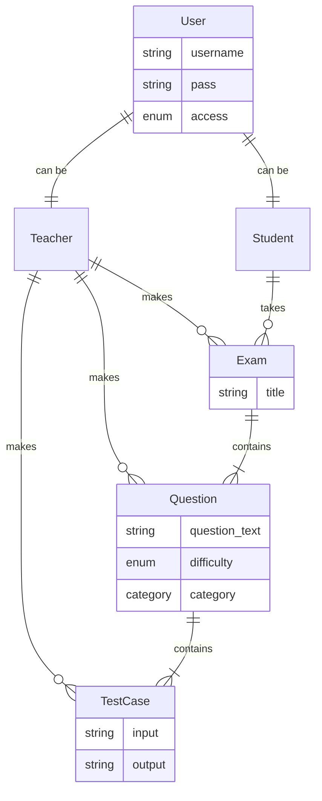

```mermaid
erDiagram

User {
    string username
    string pass
    enum access
}
User  ||--|| Teacher : "can be"
User  ||--|| Student : "can be"

Teacher ||--o{ Exam : "makes"
Teacher ||--o{ Question : "makes"
Teacher ||--o{ TestCase : "makes"

Student ||--o{ Exam : "takes"

Question {
    string question_text
    enum difficulty
    category category
}
TestCase {
    string input
    string output
}
Exam {
    string title
}

Question ||--|{ TestCase : "contains"
Exam ||--|{ Question : "contains"
```